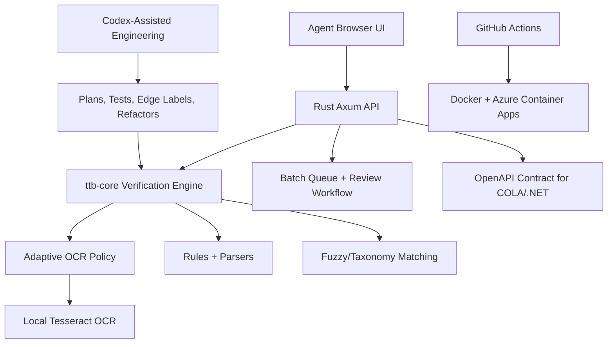

# TTB Label Verifier

AI-assisted, offline-first Rust app for alcohol label verification.

This project was built for the TTB AI-powered alcohol label verification take-home.
It verifies uploaded alcohol label images against application data, supports single
and batch review workflows, and is deployed as a Dockerized Rust service on Azure
Container Apps.

The product goal is a one-stop shop for TTB agents: upload application data and
label images, compare them automatically, triage pass/review/fail results, correct
application issues in the same workflow, and export the final review output without
leaving the tool.

## Project Links

- Live app: <https://ttb-label-verifier.greensea-d13af920.eastus2.azurecontainerapps.io/>
- Repository: <https://github.com/avinashsriram1/TTB-Label-Verifier>
- OpenAPI contract: <https://ttb-label-verifier.greensea-d13af920.eastus2.azurecontainerapps.io/api/openapi.json>
- Health/config check: <https://ttb-label-verifier.greensea-d13af920.eastus2.azurecontainerapps.io/api/health>

## Summary

- Full Rust implementation: Axum API plus framework-neutral `ttb-core` verification engine.
- Offline OCR at runtime: local Tesseract is bundled in the container; no cloud OCR,
  LLM, Azure ML, or external inference endpoint is required.
- Adaptive OCR: fast first pass for easy labels, bounded enhanced retries for hard
  labels, and rotation retries for side-panel warning text.
- Batch-first workflow: CSV/JSON manifests, multi-image products, in-memory batch
  queue, review/fail triage, CSV export, and bounded parallel OCR.
- Agent workflow support: labels can be checked, corrected, failed, dismissed, and
  exported from the same browser experience.
- CI/CD enabled: GitHub Actions builds the Docker image and deploys `main` to Azure
  Container Apps.
- AI-engineered workflow: Codex was used as an architecture and implementation
  partner, while the deployed verifier remains deterministic, auditable, and local.

## Problem at Hand v.s. Solution Implemented

| Problem | Solution |
|---|---|
| Results need to be fast enough for agents to use | Per-image OCR budget, latency telemetry, fast-first OCR, bounded enhanced retries |
| Network may block cloud ML endpoints | OCR and verification run inside the container with local Tesseract |
| Agents vary in technical comfort | One-stop shop with clear Single, Batch, and Review tabs; help modals; visible pass/review/fail statuses |
| Batch imports are a major pain point | CSV/JSON manifests, grouped images per product, bounded parallelism, result filtering, CSV export |
| Future COLA/.NET integration should be possible | OpenAPI/HTTP API boundary and framework-neutral Rust core crate |
| PII and retention require care | Raw OCR hidden by default; no durable image storage; in-memory batch jobs with TTL cleanup |

## AI Engineering Approach

Codex was used as an AI engineering partner throughout the project, not as a
runtime dependency.

Codex helped with:

- Interpreting the take-home prompt and converting stakeholder notes into an
  implementation plan.
- Comparing architectural options, including cloud OCR, local OCR, Rust, and
  future LiteRT/RapidOCR/ONNX paths.
- Building the Rust workspace, Axum API, OCR abstraction, Docker deployment, and
  GitHub Actions pipeline.
- Iterating through edge cases: proof-to-ABV conversion, title-case warnings,
  country inference from city/state text, side-panel warning text, OCR confidence,
  and raw OCR leakage.
- Generating compliant, noncompliant, image-rich, and hard-case labels for testing.
- Reasoning through differences between local Docker behavior and Azure Container
  Apps resource constraints.

Important distinction: Codex accelerated the engineering process, but the deployed
application does not call Codex, an LLM, cloud OCR, or external ML services at
runtime. The verifier uses local OCR plus deterministic compliance rules.

## Architecture



Workspace layout:

```text
crates/ttb-core   Framework-neutral OCR, matching, warning, manifest, and verification logic
crates/ttb-api    Axum API, batch jobs, static UI hosting, OpenAPI, CSV export
crates/ttb-ui     Vite/TypeScript frontend
samples/          Generated compliant, noncompliant, image-rich, and hard-case labels
Dockerfile        Offline deployment image with Rust API, UI assets, and Tesseract
```

## Why Rust?

Rust was chosen because this problem is a good fit for a small, high-confidence
verification service:

- Strong type boundaries for compliance data, OCR spans, field checks, and verdicts.
- Predictable native performance for OCR-heavy workflows.
- Memory safety without a garbage-collected runtime.
- Small Docker deployment surface.
- Clean separation between core verification logic and web hosting.
- Easy future integration with COLA through HTTP/OpenAPI without sharing a frontend
  framework or runtime with .NET.

The result is not a UI-only prototype. The compliance logic lives in `ttb-core`,
which can be reused behind different integration surfaces later.

## What the App Verifies

The app compares uploaded label artwork against application fields:

- Brand name
- Class/type
- Alcohol content, including proof equivalence such as `80 Proof == 40% ABV`
- Net contents with unit normalization
- Bottler/producer
- Country of origin, including common aliases and US city/state inference
- Government warning heading

Government warning policy:

- Missing warning: fail
- `Government Warning` in title case: fail
- `GOVERNMENT WARNING` in all caps: pass

The current implementation intentionally does not require word-for-word warning
body matching because OCR can distort small statutory text. The all-caps heading
remains a hard compliance check, and raw OCR is available only behind explicit
debug configuration.

## Adaptive OCR and Verification

The OCR pipeline is designed to avoid the 30-40 second failure mode described in
the prompt:

1. Run a fast primary OCR pass.
2. Evaluate deterministic field checks and warning detection.
3. If the first result fails, run a bounded enhanced retry while staying inside
   the per-image budget.
4. Try rotation-aware OCR for sideways warning panels.
5. Return pass, review, or fail with timing and OCR pass telemetry.

This gives easy labels a fast path while still giving hard labels a second chance.
The system records processing path, OCR passes, confidence, latency, budget status,
and enhanced-retry usage for debugging and evaluation.

## Batch Workflow

Batch review is a first-class workflow:

- Upload many label images at once.
- Optionally provide a CSV or JSON manifest with expected application fields.
- Group 1-4 images into the same product, such as front and back labels.
- Process products with bounded parallelism to avoid saturating OCR.
- Prioritize review/fail results for agents.
- Review, correct, dismiss, or manually fail problematic applications without
  switching systems.
- Export batch results to CSV.
- Keep batch jobs in memory with TTL cleanup for prototype-friendly retention.

This is intentionally single-replica for the prototype because batch state is
in-memory. Horizontal scaling should be added only after moving batch state to a
shared store.

## CI/CD and Deployment

GitHub Actions is enabled for continuous deployment from `main`:

1. Checkout code.
2. Build Docker image.
3. Push image to Azure Container Registry.
4. Update Azure Container Apps with the new image and runtime flags.

Azure is used only for container hosting. OCR and verification run inside the
container. The app does not depend on Azure ML, cloud OCR, hosted LLMs, or outbound
model endpoints.

### In-Built Developer Debug Mode

Developer Debug Mode is available for troubleshooting OCR behavior, but it is locked
behind safe defaults. The UI debug toggle only exposes raw OCR when the server is
explicitly configured with `TTB_ALLOW_CLIENT_DEBUG=true` or `TTB_SHOW_RAW_OCR=true`.
In the deployed agent workflow, OCR/debug details and raw OCR are inaccessible by
default.

Production-oriented runtime defaults:

```text
TTB_SHOW_RAW_OCR=false
TTB_ALLOW_CLIENT_DEBUG=false
TTB_PROCESSING_PROFILE=adaptive
TTB_IMAGE_TIME_BUDGET_MS=4500
TTB_BATCH_PARALLELISM=2
TTB_BATCH_JOB_TTL_SECONDS=3600
TTB_SPAN_LABEL_MODE=candidate
OMP_THREAD_LIMIT=1
```

## API and COLA Integration

Primary routes:

- `POST /api/verify`
- `POST /api/batch/jobs`
- `GET /api/batch/jobs/{job_id}`
- `GET /api/batch/jobs/{job_id}/export.csv`
- `POST /api/corrections`
- `GET /api/corrections/export.csv`
- `GET /api/health`
- `GET /api/openapi.json`

Future COLA integration can start with the OpenAPI contract. COLA does not need
to embed Rust or the frontend. It can call this verifier as an internal HTTP
service, sidecar, or future gRPC/C ABI adapter if required.

## Run Locally

Install:

- Rust
- Node.js
- Tesseract OCR

Build the UI and run the API:

```powershell
cd crates/ttb-ui
npm install
npm run build
cd ../..
cargo +stable-x86_64-pc-windows-gnu run -p ttb-api
```

Open:

```text
http://localhost:8080
```

Docker:

```powershell
docker build -t ttb-label-verifier .
docker run --rm -p 8080:8080 `
  -e TTB_SHOW_RAW_OCR=false `
  -e TTB_ALLOW_CLIENT_DEBUG=false `
  -e TTB_PROCESSING_PROFILE=adaptive `
  -e TTB_IMAGE_TIME_BUDGET_MS=4500 `
  -e TTB_BATCH_PARALLELISM=2 `
  -e OMP_THREAD_LIMIT=1 `
  ttb-label-verifier
```

## Testing and Evaluation

Validation commands:

```powershell
cargo +stable-x86_64-pc-windows-gnu test
cargo fmt --all -- --check
cd crates/ttb-ui
npm run build
```

The test suite and sample corpus cover:

- Missing warning failure
- Title-case warning failure
- All-caps warning pass
- ABV/proof equivalence
- Net contents normalization
- Country aliases and US city/state inference
- Sanitized observed values with no raw OCR leakage
- CSV and JSON manifest parsing
- Adaptive OCR retry ordering
- Batch policy and telemetry behavior

The `samples/` directory includes compliant, noncompliant, image-rich, and hard-case
labels for repeatable testing.

## Assumptions and Tradeoffs

- This is a prototype, not a system of record.
- Uploaded images are not durably stored by default.
- Batch jobs use in-memory state with TTL cleanup to keep retention simple.
- Horizontal replica scaling should wait until batch state is externalized.
- Warning body word-for-word matching is not enforced because OCR noise can distort
  small warning text; the all-caps `GOVERNMENT WARNING` heading remains a hard check.
- Future local-only AI improvements could include RapidOCR/ONNX benchmarking,
  learned span labeling from corrections, and LiteRT.js for client-side image
  quality or warning-region scoring.

## What Goes Beyond the Minimum

- Full Rust architecture rather than a thin scripting prototype.
- Offline/firewall-safe OCR deployment.
- Adaptive OCR with explainable telemetry.
- Agent-centered one-stop workflow for matching applications to labels, correcting
  issues, deciding final failures, and exporting results.
- CI/CD to a public Azure Container Apps URL.
- Generated test corpus for edge-case validation.
- COLA-ready OpenAPI boundary.
- AI-assisted engineering process using Codex while keeping runtime behavior
  deterministic and auditable.
